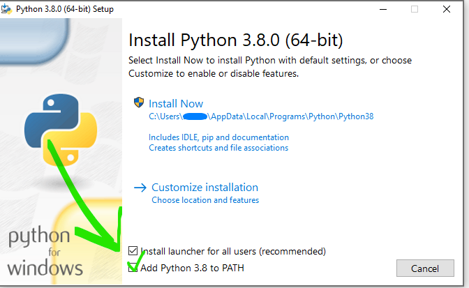

# Developing
!!! Info 
    If you just want to use or change the config files proceed to the next section.
To develop on the project, perform the following steps.

## Prerequisites
This project uses Python 3.8 for the code, it is also needed to preview the documentation locally. This can be installed from the [Python website](https://www.python.org/downloads/windows/).
Make sure to select checkmark to add Python into the system path.
<figure>
  
</figure>
You may also need Visual C++ which can be installed via the [build tools installer](https://visualstudio.microsoft.com/thank-you-downloading-visual-studio/?sku=BuildTools&rel=16)

## Documentation
The documentation uses [mkdocs](https://www.mkdocs.org/) with the [material](https://squidfunk.github.io/mkdocs-material/) theme. The table of contents is managed in `mkdocs.yml`, all the pages are located in the `docs` subfolder.  Run the following commands once to install mkdocs.
```
pip install mkdocs
pip install mkdocs-material
```
After that the documentation can be generated with the command below. This will host a website on localhost that is automatically updated when you save a file.
```
mkdocs serve
```

## Code
To work on the code clone the code, setup a virtual environment and install the requirements.
```batch
REM Create and activate a virtual environment
python -m venv env
.\env\Scripts\activate
REM Install requirements
pip install -r requirements.txt
REM Start msfs and run the application
python main.py
```

### Building the exe
The exe is created with pyinstaller this needs to be installed seperately through `pip install pyinstaller`.
After that create the exe with the following command:
```
pyinstaller main.spec
```
