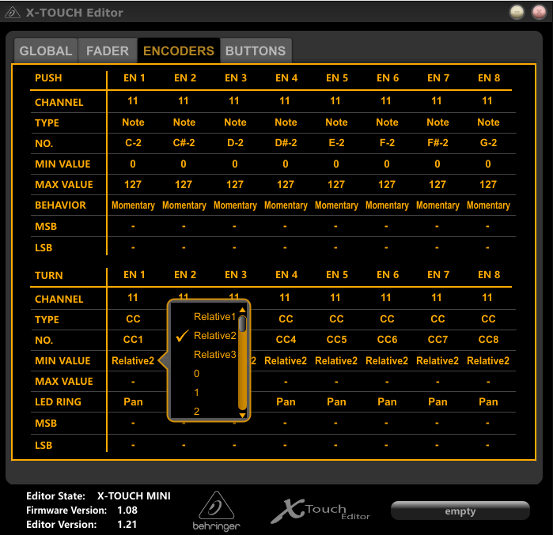

# Installation & Configuration

## Download
Download the zip and extract it.  
[Download latest version :material-download:](https://github.com/maartentamboer/X-Touch-Mini-FS2020/releases/latest/download/X-Touch-Mini-FS2020.zip){ .md-button .md-button--primary }
[View all versions](https://github.com/maartentamboer/X-Touch-Mini-FS2020/releases){.md-button}

## Configure X-Touch
The encoders of X-Touch must be set to Relative2 mode to work with this application.
This can be done in the X-Touch editor software from Behringer than can be downloaded from the [product page](https://www.behringer.com/product.html?modelCode=P0B3M). You only need to do this once.

1. Open the X-Touch editor
1. Click the `Load` button and select `LayerA.bin` from the `X-Touch-Editor-Configs` folder
1. Click the `Dump A` button to write the config to the X-Touch
1. Click the `Load` button and select `LayerB.bin` from the `X-Touch-Editor-Configs` folder
1. Click the `Dump B` button to write the config to the X-Touch
<figure>
  
</figure>

## Run
Flight Simulator 2020 must be running before you start this application. Once you're in the main menu double click `X-Touch-Mini-FS2020.exe` to start the application.

## Changing the configuration
See the [Configuration guide](../../configuration/general) for more information
