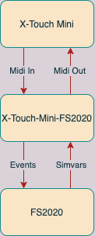

# How does it work
This application receives midi data from the X-Touch and translates it to events in FS2020.
It receives data from FS2020 through simvars and controls the LEDs on the buttons and the encoders.
<figure>
  
</figure>

## Events
A list of supported events can be found in [Eventlist.py](https://github.com/odwdinc/Python-SimConnect/blob/master/SimConnect/EventList.py)

## Simvars
A list of supported simvars can be found in [RequestList.py](https://github.com/odwdinc/Python-SimConnect/blob/master/SimConnect/RequestList.py)